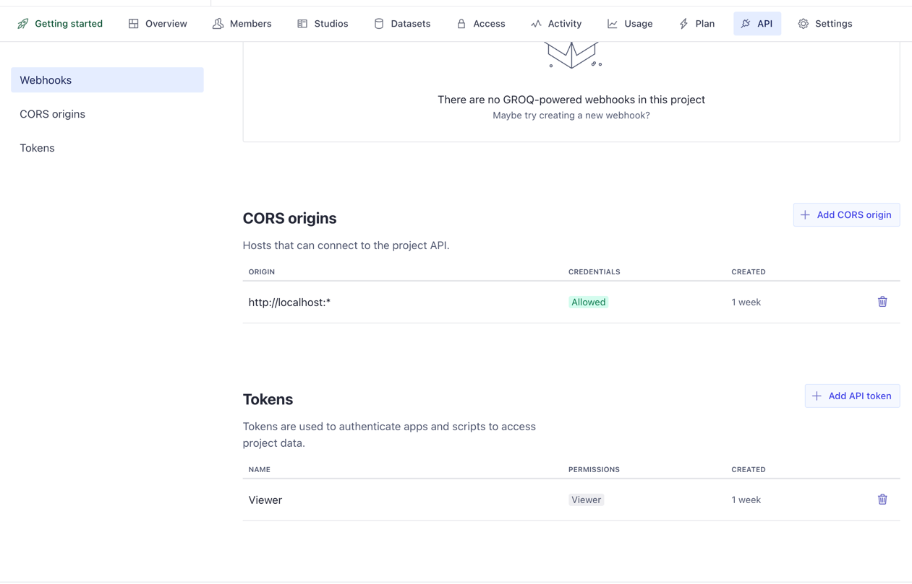

import { Aside } from '@astrojs/starlight/components'

This guide walks you through setting up Sanity.io as your headless CMS for Vyuh
React applications. Sanity provides a flexible content platform that works
seamlessly with Vyuh's content-driven approach.

<Aside type="tip">
  Sanity.io offers a generous free tier that's perfect for getting started with
  Vyuh React.
</Aside>

## Why Sanity?

Vyuh works well with Sanity because:

- **Schema as code**: Define your content models in TypeScript rather than a GUI
- **Customizable Studio**: Tailor the editing experience for content creators
- **Real-time updates**: Content changes appear instantly in your app
- **Powerful query language**: GROQ lets you fetch exactly the data you need

## 1. Create a Sanity project

If you're using the Vyuh React Workspace template repository, you'll need to
create a Sanity project inside the `apps/studio` folder:

```bash
# Navigate to the studio folder
cd apps/studio

# Initialize a new Sanity project
pnpx sanity@latest init
```

During setup:

- Choose "Create a new project"
- Give your project a name
- Use the default dataset configuration
- Select "Clean project with no predefined schemas" as your template

## 2. Install Vyuh Sanity packages and configure your project

If you're using the Vyuh React Workspace template, the miscellaneous feature is
already included. You'll need to install the Vyuh Sanity packages and update
your `sanity.config.ts` file:

```bash
# Navigate to your Sanity project directory (if not already there)
cd apps/studio

# Install Vyuh Sanity packages
pnpm add @vyuh/sanity-plugin-structure @vyuh/sanity-schema-core @vyuh/sanity-schema-system

# Add the miscellaneous schema package as a workspace dependency (it's already in the workspace)
pnpm add sanity-schema-misc
```

Then update your `sanity.config.ts` file to use the Vyuh structure plugin and
include the miscellaneous feature:

```typescript {5,18}
// apps/studio/sanity.config.ts
import { defineConfig } from 'sanity'
import { vyuh } from '@vyuh/sanity-plugin-structure'
import { system } from '@vyuh/sanity-schema-system'
import { misc } from 'sanity-schema-misc' // Import the miscellaneous feature

export default defineConfig({
  name: 'default',
  title: 'Your Project Name',

  projectId: '<your-project-id>', // Replace with your projectId from sanity.cli.ts
  dataset: 'production',

  plugins: [
    vyuh({
      features: [
        system,
        misc, // The miscellaneous feature from the template
      ],
    }),
  ],
})
```

> Replace `<your-project-id>` with your actual Sanity project ID from
> `sanity.cli.ts`. You can also give a nice **title** to your project, while you
> are at it.

<Aside type="note" title="Vyuh Sanity Plugin">
  The Vyuh structure plugin (`@vyuh/sanity-plugin-structure`) automatically
  organizes your schemas by feature in the Sanity Studio, making it easier to
  manage complex content models as your application grows.
</Aside>

## 3. Start your Sanity Studio

Run your Sanity Studio to see your schemas in action:

```bash
cd apps/studio
pnpm run dev
```

Your Sanity Studio should now be running at **`http://localhost:3333`** with
your schemas available.

## 4. Configure API access

To connect your Next.js app to Sanity, you'll need to configure API access:

1. Go to [manage.sanity.io](https://manage.sanity.io)
2. Select your project
3. Navigate to API > Tokens
4. Create a new token with "Viewer" permissions for your frontend
5. Save this token securely - you'll need it for your React app

### Configure CORS origins

You also need to configure CORS to allow your Next.js app to access the Sanity
API:

1. In the Sanity management console, go to API > CORS origins
2. Click "Add CORS origin"
3. Enter `http://localhost:*`
4. Check "Allow credentials" if you need authenticated requests
5. Save the configuration



## 5. Configure Environment Variables for Next.js

In your Next.js app, set the following environment variables in your
`.env.local` file:

```bash
NEXT_PUBLIC_SANITY_PROJECT_ID=<your-project-id>
NEXT_PUBLIC_SANITY_DATASET=production
NEXT_PUBLIC_SANITY_TOKEN=<your-token>
```

## Next Steps

Now that you have Sanity set up with your schemas, you're ready to:

1. Create some sample content in your Sanity Studio
2. Connect your Next.js app to Sanity using the Vyuh content provider
3. Render your content in your React application

Continue to [Rendering Content with Vyuh React](/react/guides/rendering-content)
to learn how to display your Sanity content in your React app.
